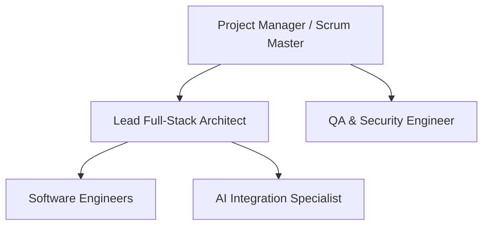
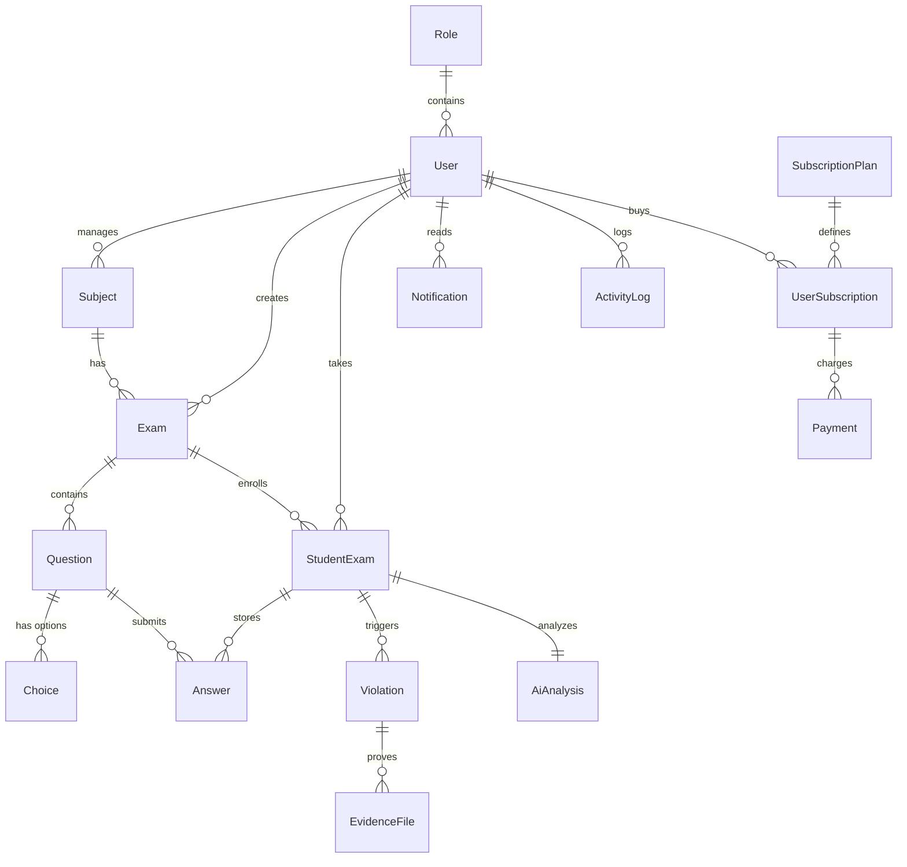

# Software Project Management Plan (SPMP)

---

# ProctorShield AI
### An AI-Powered Online Examination & Remote Proctoring System

**Document Version:** 2.0.0  
**Date:** May 23, 2026  
**Course:** Capstone Project / Software Engineering  
**Prepared For:** University Academic Board / Computer Science Department  
**Prepared By:** Christian Glenn Pacaldo & Team  
**Institution:** ChristianGlenn-Pacaldo/ProctorShieldAI Team  

---

## 1. Title Page & Document Control

### Document Identification
*   **Project Title:** ProctorShield AI
*   **System Subtitle:** An AI-Powered Online Examination & Remote Proctoring System
*   **Classification:** Technical Documentation / Software Project Management Plan (SPMP)
*   **Repository URI:** [ProctorShieldAI Repo](file:///c:/Users/roron/OneDrive/Desktop/proctorshieldai)

### Document History
| Version | Date | Description | Author(s) |
| :--- | :--- | :--- | :--- |
| 1.0.0 | May 19, 2026 | Initial draft for Capstone proposal. | Christian Glenn Pacaldo |
| 2.0.0 | May 23, 2026 | Comprehensive academic restructuring; added risk matrices, cost, team roles, AI parameters, and technical architecture details. | System Agent / Lead Architect |

---

## 2. Table of Contents
1. [Title Page & Document Control](#1-title-page--document-control)
2. [Table of Contents](#2-table-of-contents)
3. [Introduction](#3-introduction)
4. [Purpose of the System](#4-purpose-of-the-system)
5. [Scope](#5-scope)
6. [Objectives](#6-objectives)
7. [Stakeholders](#7-stakeholders)
8. [Project Organization](#8-project-organization)
9. [Project Management Process](#9-project-management-process)
10. [Software Development Methodology](#10-software-development-methodology)
11. [Technical Architecture](#11-technical-architecture)
12. [Database Design Overview](#12-database-design-overview)
13. [Functional Requirements](#13-functional-requirements)
14. [Non-Functional Requirements](#14-non-functional-requirements)
15. [Security and Privacy Plan](#15-security-and-privacy-plan)
16. [AI Integration Plan](#16-ai-integration-plan)
17. [Risk Management Plan](#17-risk-management-plan)
18. [Testing and QA Plan](#18-testing-and-qa-plan)
19. [Deployment Plan](#19-deployment-plan)
20. [Maintenance Plan](#20-maintenance-plan)
21. [Timeline and Milestones](#21-timeline-and-milestones)
22. [Cost Estimation](#22-cost-estimation)
23. [Team Responsibilities](#23-team-responsibilities)
24. [Conclusion & Appendices](#24-conclusion--appendices)

---

## 3. Introduction

### Project Background
The rapid, structural shift of global education systems towards online classrooms, hybrid studies, and remote testing has highlighted a critical vulnerability: the preservation of academic integrity in non-invigilated spaces. Traditional assessments taken outside institutional computer labs suffer high vulnerability to external resources, secondary device usage, tab switching, and proxy test-taking.

### Problem Statement
Existing online proctoring solutions are plagued by high deployment costs, complex desktop-level agent installations that pose operating system vulnerabilities, or heavy reliance on human invigilators who must perform tedious, manual reviews of hours of recorded feeds. There is a critical academic and industry need for a lightweight, web-based, platform-independent solution that automates cheating detection in real-time using modern artificial intelligence models, without requiring root-access browser plugins or intrusive local software.

### Significance of the Study
This project demonstrates the integration of advanced multimodal Large Language Models (LLMs) like Google Gemini and low-latency websocket notification engines into a standardized web application. The study proves that high-fidelity remote proctoring can be implemented entirely in a standard browser environment using standard API endpoints, minimizing privacy risks and overhead.

---

## 4. Purpose of the System
The purpose of **ProctorShield AI** is to offer a comprehensive, low-cost, and scalable online examination platform equipped with automated real-time proctoring. The system aims to:
*   Empower academic institutions to conduct remote examinations with high confidence in the integrity of student scores.
*   Provide instructors with a real-time monitoring dashboard displaying aggregated analytics and visual snapshots of ongoing exam sessions.
*   Minimize invigilator fatigue by employing AI to filter, analyze, and flag suspicious student behaviors (looking away, device usage, absent face, or multiple faces) during the exam.
*   Enforce absolute client-side browser restrictions to lock down the exam room interface and prevent standard digital copying behaviors.

---

## 5. Scope
The scope of ProctorShield AI is bounded by three major role-based portals and a specialized AI examination engine:

```
  ┌─────────────────────────────────────────────────────────────┐
  │                        ProctorShield AI                      │
  ├──────────────────┬───────────────────┬──────────────────────┤
  │  Student Portal  │  Teacher Portal   │     Admin Portal     │
  ├──────────────────┼───────────────────┼──────────────────────┤
  │ - Secure Exam Rm │ - Exam Creator    │ - User Audit Log     │
  │ - Webcam Stream  │ - Live Monitoring │ - Suspensions        │
  │ - AI Diagnoses   │ - Integrity Audit │ - System Config      │
  └──────────────────┴───────────────────┴──────────────────────┘
```

### In Scope
1.  **Student Portal:** Entering exams via access codes, webcam verification, answering multiple-choice questions (MCQs), receiving client warnings, and submitting exams under secure lockouts.
2.  **Teacher Portal:** Creating custom exams, generating access codes, utilizing Gemini to auto-generate questions, monitoring live video snapshot feeds, and viewing final integrity reports.
3.  **Admin Portal:** Centralized user management (activating/suspending users), viewing system logs, and altering global settings.
4.  **AI Proctoring Pipeline:** Base64 webcam frame upload, image formatting, server-side Gemini API querying, response parsing, and Pusher notification broadcasting.

### Out of Scope
*   **WebRTC Continuous Video Streaming:** Due to expensive STUN/TURN server requirements, continuous video streaming is replaced by high-frequency 3-second REST snapshot uploads.
*   **OS-Level System Locking:** Blocking software like Snipping Tool or external hardware capture cards is out of scope due to browser sandbox limits.

---

## 6. Objectives
The quantifiable metrics and targets for the ProctorShield AI implementation include:
*   **AI Detection Accuracy:** Maintain a $>95\%$ True Positive rate for explicit violations like `device_detected` and `no_face`.
*   **Alert Latency:** Ensure websocket-based violation alerts are delivered to the Teacher's Dashboard in under $1.5\text{ seconds}$ from server recognition.
*   **Polling Latency:** Student camera snapshots must upload and render on the teacher grid within $3.0\text{ seconds}$ average latency.
*   **System Availability:** Ensure $99.9\%$ uptime for the core examination API to prevent network-based student dropouts.
*   **False Positive Mitigation:** Employ a "fail-open" policy where any network or API failures regarding the AI model do not disrupt or terminate the student's exam.

---

## 7. Stakeholders

| Stakeholder Group | Description | Primary Interest |
| :--- | :--- | :--- |
| **Examinees (Students)** | Enrolled students completing assessments remotely. | Smooth, non-intrusive UI; clear feedback on connection status; data privacy preservation. |
| **Educators (Teachers)** | Instructors setting up exams and evaluating student submissions. | Simple exam generation; robust, real-time alerts; automated, reliable cheating detection records. |
| **Administrators (Admins)** | Institutional IT personnel managing the system instance. | Clean system logs; simple user suspension tools; system stability; secure credential management. |
| **Academic Integrity Boards** | School committees evaluating cheating disputes. | Forensic audit trails; timestamped image evidence of violations; transparent AI explanation logs. |
| **System Developers** | Software engineers maintaining the Next.js platform. | Type safety; structured database migrations; clear API contracts; cost-efficient cloud resource usage. |

---

## 8. Project Organization
The ProctorShield AI project is structured under a flat Agile product organization:



*   **Scrum Master/PM:** Enforces process timelines, schedules sprint reviews, and clears external dependencies.
*   **Lead Architect:** Directs tech-stack implementation, designs the database models, and oversees code integrations.
*   **Development Team:** Writes React components, builds API controllers, and maintains styling systems.
*   **AI/Data Engineer:** Manages prompt optimizations, handles image encoding schemes, and ensures API security.
*   **QA & Security Engineer:** Audits client security lockouts, conducts network latency checks, and performs credential validation audits.

---

## 9. Project Management Process
The project utilizes the **Agile Scrum Framework** to manage tasks, schedules, and deliverables. 

### Scrum Ceremonies
*   **Sprint Planning (Bi-Weekly):** Define the Sprint Goal, select items from the Product Backlog, and estimate tasks in Story Points.
*   **Daily Standup (15 Mins):** Discuss work completed yesterday, plans for today, and any blockages.
*   **Sprint Review (End of Sprint):** Demonstrate working modules (e.g., student camera uploads, teacher alert feeds) to stakeholders for feedback.
*   **Sprint Retrospective (End of Sprint):** Assess team performance and identify process improvements.

### Collaboration Tools
*   **Version Control:** Git on GitHub with a branch workflow (`main` protection, `dev` integration, `feature/*` development).
*   **Task Board:** Jira for sprint backlogs, bug tracking, and milestone burn-down charts.
*   **Communications:** Slack for team updates, combined with automated webhook feeds from GitHub repository commits.

---

## 10. Software Development Methodology
The Software Development Life Cycle (SDLC) is implemented iteratively across six phases:

```
  ┌─────────────────────────────────────────────────────────────┐
  │                      SDLC Iterative Phases                  │
  ├──────────────┬──────────────┬──────────────┬────────────────┤
  │ 1. Proposal  │ 2. Schema    │ 3. API & AI  │ 4. Client lock │
  │    & Scope   │    Design    │    Engines   │    & UI Dash   │
  ├──────────────┴──────────────┼──────────────┴────────────────┤
  │ 5. System Integration       │ 6. QA, Security & Launch       │
  └─────────────────────────────┴───────────────────────────────┘
```

1.  **Requirement Analysis & Prototyping:** Mapping user portals and defining API parameters.
2.  **Database & Schema Modeling:** Drafting the schema, modeling the tables, and setting constraints inside [schema.prisma](file:///c:/Users/roron/OneDrive/Desktop/proctorshieldai/prisma/schema.prisma).
3.  **Core API and AI Prototyping:** Implementing server-side route logic to interface with the Google Gemini API.
4.  **UI & Secure Client Integration:** Building dashboard portals and adding browser event listeners.
5.  **Integration & WebSockets Tuning:** Tuning Pusher configurations, optimizing base64 serialization, and verifying state synchronizations.
6.  **Security Audit, QA & Release:** Verifying database indexing performance, validating token-cookie protections, and deploying database seeds.

---

## 11. Technical Architecture
The system employs a serverless-centric architecture. Next.js coordinates both the frontend React client and the backend serverless endpoints, which communicate with managed Postgres and WebSocket platforms.

```mermaid
graph TD
    subgraph Client [Client-Side Browser]
        UI[Next.js React Frontend]
        BC[Browser Constraints]
        CAM[Webcam Capture]
    end

    subgraph Server [Next.js API Layer]
        AUTH_API[/api/auth/*]
        EXAM_API[/api/exams/*]
        LIVE_API[/api/live/*]
        MEM[In-Memory Snapshot Cache]
    end

    subgraph External_Services [Managed Services]
        DB[(Neon PostgreSQL)]
        AI[Google Gemini Vision AI]
        WS[Pusher WebSockets]
    end

    UI -->|HTTP POST/GET| AUTH_API
    UI -->|HTTP POST/GET| EXAM_API
    UI -->|HTTP GET Poll 3s| LIVE_API
    CAM -->|HTTP POST 3s| LIVE_API
    CAM -->|HTTP POST 20s| LIVE_API

    AUTH_API <-->|Prisma ORM| DB
    EXAM_API <-->|Prisma ORM| DB
    LIVE_API <-->|Analyze Frame| AI
    LIVE_API <-->|Trigger Alerts| WS
    WS -->|Push Events| UI
    LIVE_API <-->|Store/Retrieve| MEM
```

### Architectural Component Justifications
*   **Next.js (App Router):** Combines Server-Side Rendering (SSR) for static dashboard pages with API endpoints in the same repository, eliminating separate server maintenance overhead.
*   **Neon DB (PostgreSQL):** A serverless PostgreSQL instance allowing autoscaling connection pooling, vital for high-concurrency exam starts.
*   **Pusher Channels:** Eliminates WebRTC signaling complex setups, utilizing secure, low-latency WebSocket infrastructure without requiring a persistent Node WebSocket server.
*   **Google Gemini API:** Uses `gemini-2.0-flash` for high-speed, cost-effective visual prompt execution.

---

## 12. Database Design Overview
The database uses a relational model managed by the Prisma client. It consists of 15 structured models mapping role privileges, exams, question sheets, student attempts, cheating logs, and billing.

### Entity Relationship Diagram



### Core Database Model Directory
The model fields correspond to [schema.prisma](file:///c:/Users/roron/OneDrive/Desktop/proctorshieldai/prisma/schema.prisma):
1.  **Role:** Defines system access (`student`, `teacher`, `admin`).
2.  **User:** Stores secure credentials, Google OAuth sub-keys, and status strings (`active`, `suspended`).
3.  **Subject:** Represents a course managed by a teacher (e.g., CS101).
4.  **Exam:** Contains access codes, duration parameters, passing score limits, and draft/active status metrics.
5.  **Question & Choice:** Standard structures for multiple-choice quiz questions.
6.  **StudentExam:** Main junction table tracking student progress, start/end timestamps, final grades, and overall AI verdicts.
7.  **Answer:** Records choices made by students for each question in an exam attempt.
8.  **Violation:** Stores raw metrics for an infraction (type, duration, confidence, timestamp).
9.  **EvidenceFile:** Stores files (e.g., screenshots) validating a recorded violation.
10. **AiAnalysis:** Saves the final, detailed Gemini-generated summary review containing risk levels (`low`, `medium`, `high`) and natural language rationale.
11. **Notification:** Handles in-app notifications for users.
12. **ActivityLog:** Audit log recording system events, administrative changes, and user login IP addresses.
13. **SubscriptionPlan & UserSubscription:** Configures subscription levels (e.g., Free vs. Premium tiers).
14. **Payment:** Tracks transaction references and payment status configurations.
15. **Setting:** System settings storage (`strict_ai_enforcement`, `max_violations_before_lock`).

---

## 13. Functional Requirements

### 13.1 Student Portal Functions
*   **Authentication:** Access accounts using standard credentials or secure Google Sign-In.
*   **Exam Access:** Enlist in an examination by providing a valid, teacher-provided 7-digit access code (e.g., `PS-8821`).
*   **Environment Check:** Enforce a hardware permissions wizard confirming webcam stream accessibility before starting.
*   **Secure Testing Interface:**
    *   Lock down copy/paste, right-clicks, and text selection.
    *   Prompt warning dialogs upon visibility-state losses (tab-switches).
    *   Submit the exam automatically if the student reaches 3 violations.

### 13.2 Teacher Portal Functions
*   **Exam Builder:** Create and customize exam parameters (time limits, point distributions, shuffling options).
*   **AI Question Generator:** Auto-create multiple-choice exams by sending a text topic or a PDF/image syllabus file directly to Gemini.
*   **Live Monitor Command Center:**
    *   Observe a live grid of student webcam snapshots that refreshes every 3 seconds.
    *   Receive instant, flashing alerts when students commit infractions.
*   **Integrity Reports:** Inspect students' final AI summaries, complete with violation histories, confidence scores, and risk ratings.

### 13.3 Administrator Portal Functions
*   **User Management:** Central list of all registered accounts. Ability to suspend users (e.g., students caught cheating).
*   **Auditing:** Review chronological IP logs of all exams created, login events, and database actions.

---

## 14. Non-Functional Requirements

### 14.1 Performance & Latency
*   **WebSocket Propagation:** Pusher event alerts must reach the client monitor in under $1.5\text{ seconds}$.
*   **Snapshot Polling Cycle:** Server-side snapshot updates must load on the teacher dashboard grid in under $3.0\text{ seconds}$ average.
*   **API Response Time:** Authentication and exam status endpoints must resolve in under $150\text{ms}$.

### 14.2 Reliability & Fault Tolerance
*   **Fail-Open AI Policy:** If the Gemini Vision API experiences an outage, rate limit, or network block, the student's exam must proceed uninterrupted. The system will skip AI analysis for that interval and log no visual violations, preventing unfair student penalization.
*   **Stateless Recovery:** If the client browser crashes, the student can log back in and resume the exam within the remaining time limit, keeping their previous answers intact in the database.

### 14.3 Accessibility
*   The exam user interface must use high-contrast color palettes and support keyboard navigation for selecting answers.

---

## 15. Security and Privacy Plan

### 15.1 Authentication and Sessions
*   **Password Hashing:** Implemented with `bcryptjs` using 12 salt rounds inside [auth.ts](file:///c:/Users/roron/OneDrive/Desktop/proctorshieldai/src/lib/auth.ts).
*   **Session Storage:** Stateless JWT session cookies named `ps_session` set with the following security attributes:
    *   `HttpOnly`: Inaccessible to client-side scripts, protecting sessions against Cross-Site Scripting (XSS).
    *   `Secure`: Enforced to only transmit over encrypted HTTPS connections.
    *   `SameSite=Lax`: Standard CSRF protection for cross-site cookie transmission.

### 15.2 Database Security
*   **SQL Injection Prevention:** Implemented via the Prisma ORM, which automatically parameterizes all queries.
*   **Role-Based Access Control (RBAC):** Middleware checks session JWT claims to enforce server-side API restrictions (e.g., student role cannot call teacher/admin routes).

### 15.3 Webcam Data Privacy
*   **No Video Streaming Storage:** To protect privacy and control database costs, ProctorShield AI does not save long video recordings to server storage.
*   **Transient Snapshots:** Webcam images are kept in server memory (`globalThis.Map`) for live monitoring and automatically deleted after 30 seconds.
*   **Violation Evidence:** Only images associated with an explicit violation are persisted to cloud storage. This reduces security exposure and simplifies GDPR and FERPA educational compliance.

---

## 16. AI Integration Plan

### 16.1 Vision Proctoring Pipeline
The visual proctoring system relies on a serverless proxy pipeline routing base64-encoded JPEGs to the Google Gemini API.

```
  Student Webcam      Next.js Server Proxy       Google Gemini API
  ┌────────────┐      ┌──────────────────┐      ┌──────────────────┐
  │ 320x240    │      │ Strip base64     │      │ Parse image &    │
  │ JPEG frame ├─────►│ prefix & format  ├─────►│ run proctoring   │
  │ every 20s  │      │ system prompt    │      │ system prompt    │
  └────────────┘      └────────┬─────────┘      └────────┬─────────┘
                               │                         │
                               │  JSON Violation Array   │
                               ◄─────────────────────────┘
```

#### The Prompt Design
The payload is routed to model `gemini-2.0-flash` in [route.ts](file:///c:/Users/roron/OneDrive/Desktop/proctorshieldai/src/app/api/live/analyze/route.ts) with a system prompt instructing the model to return a structured JSON array containing only the following violation keys:
*   `no_face`: No face is present in the frame.
*   `multiple_faces`: Multiple people are visible.
*   `looking_away`: Gaze is significantly turned off-screen.
*   `device_detected`: Cellphone, tablet, or secondary monitor is in view.

```typescript
const response = await ai.models.generateContent({
  model: "gemini-2.0-flash",
  contents: [
    { inlineData: { mimeType: "image/jpeg", data: base64Data } },
    { text: "System prompt instructions for violation logging..." }
  ]
});
```

To limit costs and API rate limits, the proctoring analysis executes at 20-second intervals per student.

### 16.2 AI Exam Generation
Teachers can use the exam generation utility in [create/route.ts](file:///c:/Users/roron/OneDrive/Desktop/proctorshieldai/src/app/api/ai/create/route.ts):
*   **Inputs:** Supports text topics or base64-encoded PDF/syllabus screenshots.
*   **API Model:** Utilizes `gemini-2.5-flash` with the API configuration `responseMimeType: "application/json"`.
*   **Output:** Returns a structured list of multiple-choice questions matching this schema:
    ```json
    [
      {
        "questionText": "What is...",
        "choices": [
          { "choiceText": "Option A", "isCorrect": false },
          { "choiceText": "Option B", "isCorrect": true }
        ]
      }
    ]
    ```

---

## 17. Risk Management Plan

| Risk Description | Category | Impact | Likelihood | Mitigation Plan |
| :--- | :--- | :--- | :--- | :--- |
| **Gemini API Rate Limiting** | Technical | High | Medium | Execute AI proctoring checks every 20 seconds instead of continuous streams. Fall back to a "fail-open" state if rate limits (HTTP 429) are reached. |
| **Webcam False Positives** | Operational | High | Low | Instruct Gemini to only report clear, high-confidence violations. Allow teachers to manually review the image logs to override incorrect AI assessments. |
| **Client-Side Bypass (OS Level)** | Technical | Medium | High | Recommend deploying the student portal inside a locked browser utility or Electron kiosk app in future phases to block OS-level tools like Snipping Tool. |
| **Connection Disruptions** | Environmental | High | Medium | Implement local caching of inputs. If connection drops, allow students to reconnect and resume the exam within the remaining time. |
| **Data Privacy Violations** | Compliance | Critical | Low | Minimize data storage. Webcam snapshots are kept in-memory and deleted after 30 seconds unless a violation is detected. |

---

## 18. Testing and QA Plan

```
  ┌─────────────────────────────────────────────────────────────┐
  │                       Testing Workflow                      │
  ├──────────────────┬───────────────────┬──────────────────────┤
  │   Unit Tests     │ Integration Tests │  Security Auditing   │
  ├──────────────────┼───────────────────┼──────────────────────┤
  │ - JWT signing    │ - Join Exam Flow  │ - XSS payload tests  │
  │ - bcrypt hash    │ - MCQ Save Flow   │ - Middleware bypass  │
  │ - Prompt schemas │ - Snapshot Poll   │ - Browser lockout    │
  └──────────────────┴───────────────────┴──────────────────────┘
```

### 18.1 Unit Testing
*   Verify key utility files including [auth.ts](file:///c:/Users/roron/OneDrive/Desktop/proctorshieldai/src/lib/auth.ts) and [prisma.ts](file:///c:/Users/roron/OneDrive/Desktop/proctorshieldai/src/lib/prisma.ts).
*   Test JWT signature verification, payload structures, and hashing behavior.

### 18.2 Integration Testing
*   Verify the exam lifecycle: Student joins via access code $\rightarrow$ starts camera $\rightarrow$ answers questions $\rightarrow$ submits responses $\rightarrow$ logs score.
*   Simulate concurrent student snapshot uploads to test database performance and server memory stability.

### 18.3 AI Integrity & Bypass Testing
*   **Infraction Testing:** Actively test the AI proctoring system with simulated infractions (holding up phones, hiding faces, looking away) to verify Gemini's detection.
*   **Bypass Testing:** Attempt bypass techniques (e.g., right-clicking, using F12 developer tools, taking screenshots) to confirm browser lockouts work as expected.

---

## 19. Deployment Plan

### 19.1 Hosting Stack
*   **Frontend & API Runtime:** Vercel serverless platform.
*   **Database:** Neon serverless PostgreSQL instance.
*   **WebSockets:** Pusher Channels cluster.

### 19.2 Continuous Integration & Continuous Deployment (CI/CD)
```
  Local Git Push ────► GitHub Actions Run ────► Vercel Auto-deploy
  (main branch)        - Lint & Type Check      - Live Production
                       - Run Prisma format
```

*   **GitHub Actions:** Automatically runs code style checks and checks for syntax compilation issues on code push.
*   **Vercel Build:** Runs Next.js build scripts and deploys preview links for feature branches, and updates production upon merge to `main`.

---

## 20. Maintenance Plan
*   **Database Archiving:** Monthly scripts migrate old logs and violation records older than 90 days to cold storage, keeping database costs and size under control.
*   **API Token Rotation:** Rotate Gemini API keys, NextAuth session keys, and Pusher credentials every 90 days.
*   **Dependency Management:** Monitor npm package updates for next, react, and tailwind to install security patches.
*   **Error Monitoring:** Monitor error rates on endpoints like `/api/live/analyze` to detect rate limiting or service degradation issues.

---

## 21. Timeline and Milestones

### Milestone Schedule
*   **Milestone 1 (Sprint 1 - Weeks 1-2): Proposal & Schema Design**
    *   *Deliverables:* Finalized SPMP, completed database model schemas, database initialization scripts.
*   **Milestone 2 (Sprint 2 - Weeks 3-4): Authentication & Exam Creation APIs**
    *   *Deliverables:* Secure login/registration flows, Google OAuth integration, exam creation wizard, access code generator.
*   **Milestone 3 (Sprint 3 - Weeks 5-6): Secure Exam Client**
    *   *Deliverables:* Lockdown exam portal with visibility tracking and keyboard shortcut blocking.
*   **Milestone 4 (Sprint 4 - Weeks 7-8): AI Proctoring Pipeline**
    *   *Deliverables:* Base64 upload logic, Gemini Vision integration, violation categorization engine.
*   **Milestone 5 (Sprint 5 - Weeks 9-10): Teacher Live Monitor**
    *   *Deliverables:* Real-time dashboard grid showing student snapshots, websocket-based violation warnings.
*   **Milestone 6 (Sprint 6 - Weeks 11-12): QA & Deployment**
    *   *Deliverables:* Security auditing, load testing, production deployment on Vercel.

---

## 22. Cost Estimation
This budget outlines estimated monthly operational costs for running ProctorShield AI:

| Service | Category | Metric | Estimated Cost (PHP/mo) | Justification |
| :--- | :--- | :--- | :--- | :--- |
| **Vercel Hosting** | Compute | Serverless API runtime | ₱1,150.00 | Professional tier for custom domains and serverless execution timeouts. |
| **Neon PostgreSQL** | Database | Storage and compute | ₱850.00 | Serverless DB pricing based on active connection load. |
| **Pusher Channels** | WebSockets | Daily WebSocket messages | ₱2,800.00 | Startup tier allowing up to 1 million messages/day and 1,000 concurrent sessions. |
| **Google Gemini API** | AI | Tokens per image request | ₱5,700.00 | Calculated for 100 students completing four 1-hour exams monthly (~20s intervals). |
| **Domain Registration**| Networking| Yearly domain license | ₱80.00 | Standard .edu or .com domain registration. |
| **Total Monthly Cost** | | | **₱10,580.00** | Budget for a departmental proctoring setup. |

---

## 23. Team Responsibilities

### Christian Glenn Pacaldo — Lead Full-Stack Architect
*   **Focus:** Next.js application routes, database model setup, page navigation.
*   **Responsibilities:** Prisma integration, backend APIs, page rendering, session configurations.

### Team Member A — Security & Constraints Specialist
*   **Focus:** Browser security constraints.
*   **Responsibilities:** Custom JavaScript event listeners to disable copy/paste, detect tab switching, and block shortcuts.

### Team Member B — AI & Real-Time Engineer
*   **Focus:** Google Gemini integrations, Pusher websocket setups.
*   **Responsibilities:** Base64 conversion pipelines, prompt engineering, live snapshot monitoring.

### Team Member C — Quality Assurance Analyst
*   **Focus:** Testing and deployment pipelines.
*   **Responsibilities:** Test script execution, performance audits, Vercel deployments.

---

## 24. Conclusion & Appendices

### Conclusion
**ProctorShield AI** provides an accessible, cost-effective, and robust remote proctoring solution by combining browser-level security checks with Gemini Vision analysis. The system's hybrid architecture bypasses websocket payload limits to deliver real-time webcam monitoring without complex client-side setups, proving the viability of web-based proctoring for modern education.

---

### Appendix A: Pre-Configured Demo Accounts
The following test credentials can be generated using [seed.ts](file:///c:/Users/roron/OneDrive/Desktop/proctorshieldai/prisma/seed.ts):

| System Role | Username / Email | Password | Access Privileges |
| :--- | :--- | :--- | :--- |
| **System Admin** | `admin@proctorshield.ai` | `admin123` | Total platform access; logs; user suspensions. |
| **Teacher** | `teacher@demo.com` | `teacher123` | Exam creation; live monitoring; AI reports. |
| **Student** | `student@demo.com` | `student123` | Join exams; submit answers; view grades. |

---

### Appendix B: Simulated Access Codes
Use these codes within the student portal to join mock exam sessions:
*   `PS-8821`: CS101 Midterm exam (Status: Active)
*   `PS-7412`: CS101 Quiz 2 on arrays and loops (Status: Completed)
*   `PS-3047`: Technical Writing Finals (Status: Draft)
*   `PS-5519`: Calculus II Quiz 3 (Status: Draft)
